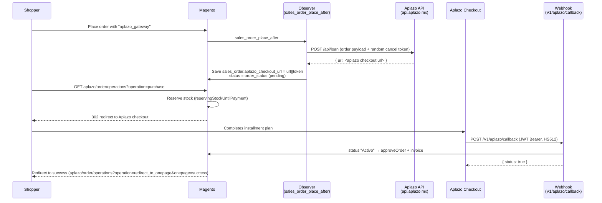
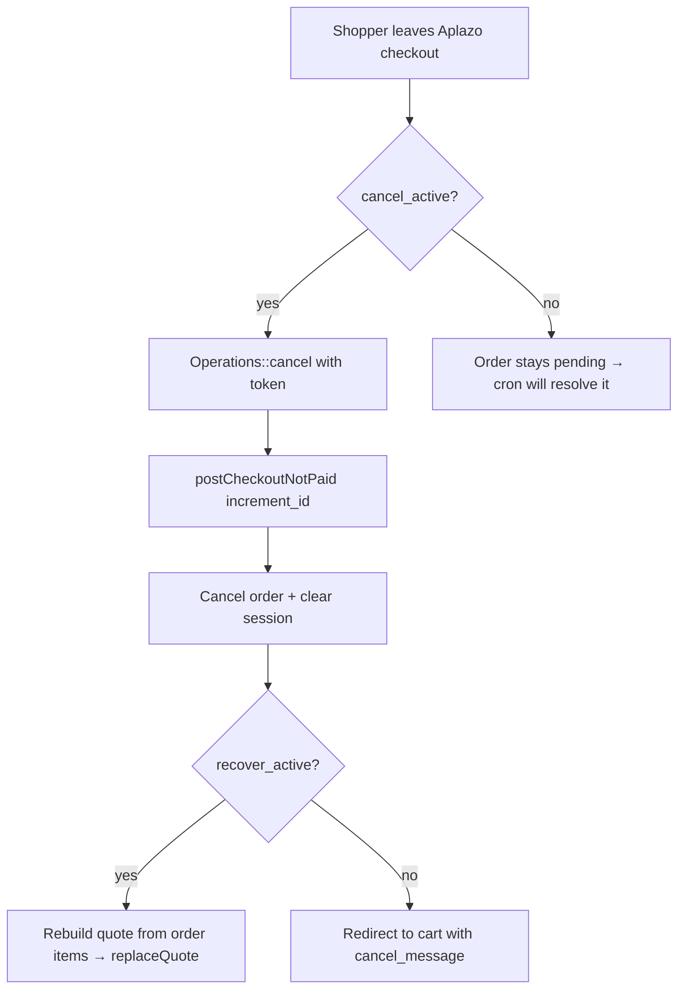

# Checkout Flow

This is the end-to-end happy path plus the abandon / cancel branches.

## Sequence

## Step by step

### 1. Order placement → loan creation

`Observer\SalesOrderPlaceAfterCreateLoan` listens to `sales_order_place_after`. When
the order's payment method is `aplazo_gateway` it:

1. Generates a 16-char random **cancel token**.
2. Fires an `order_created` tracking event (best-effort).
3. Calls `OrderService::createLoan()` → `ApiService::createLoan()` →
   `POST {serviceUrl}/api/loan`.
4. On a response containing `url`, stores it on the order as
   `aplazo_checkout_url = "<url>||<token>"` and sets the order status to
   `order_status` (default `pending`).

If no `url` comes back, an error is logged and the order has no redirect URL.

### 2. Redirect to Aplazo

The frontend controller `aplazo/order/operations` (`Controller\Order\Operations`)
dispatches by `operation` param:

- **`purchase`** — reserves stock, splits `url||token`, and 302-redirects to the
  Aplazo checkout URL. If the URL is missing it redirects back to `checkout/cart`
  with an error.
- **`cancel`** — used when the shopper abandons the Aplazo checkout (see
  [Webhook & Callbacks → abandoned checkout](webhooks.md#abandoned-checkout)).
- **`redirect_to_onepage`** — restores the quote/order in session and sends the
  shopper to `checkout/onepage/success` or `.../failure`.

### 3. Payment confirmation (webhook)

Aplazo calls `POST /V1/aplazo/callback` with a JWT. On `status = "Activo"` the order
is approved (`approveOrder`), optionally invoiced and emailed, and the loan id/status
are stored in payment additional information. See [Webhook & Callbacks](webhooks.md).

### 4. Stock reservation

When `reserve_stock` is enabled, inventory is held from redirect until the webhook
confirms payment. On cancellation, `Observer\Order\CancelAfter` (event
`order_cancel_after`) compensates stock.

## Abandon / not-paid branch

## Safety-net cron

Independently of the webhook, the **cancel-orders cron** (every 15 min) looks at
orders older than `cancel_time` minutes and, for each, checks the loan status in
Aplazo:

- If any loan is `OUTSTANDING` → the order is **recovered** (approved/invoiced).
- Otherwise → the order is **cancelled**.

See [Cron & CLI](cron-and-cli.md).
