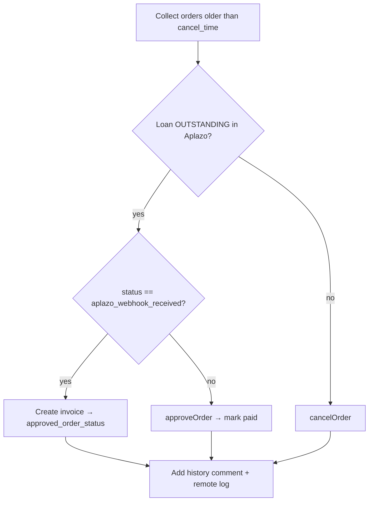

# Cron & CLI

## Cron jobs (`etc/crontab.xml`, group `default`)

| Job name | Class | Schedule | Purpose |
|---|---|---|---|
| `aplazo_aplazopayment_cancel_orders` | `Cron\CancelOrders` | `*/15 * * * *` | Resolve stale unpaid Aplazo orders |
| `aplazo_aplazopayment_process_refund_queue` | `Cron\ProcessRefundQueue` | `*/5 * * * *` | Drain the refund queue |

Both require Magento cron to be running (`bin/magento cron:run` via system crontab).

### Cancel orders (every 15 min)

Only runs when `cancel_time` is set. It collects orders older than `cancel_time`
minutes and, per order, calls `ApiService::shouldCancelOrder()` which reads the loan
status from Aplazo (`GET /api/pos/loan/{incrementId}`):

This is the safety net for missed/failed webhooks: a paid order is **recovered**, an
unpaid one is **cancelled**. Cancellation triggers `order_cancel_after` →
`Observer\Order\CancelAfter` for stock compensation, and the cancel is also propagated
to Aplazo (`/api/pos/loan/cancel`) even if the Magento-side cancel fails.

### Process refund queue (every 5 min)

Delegates to `RefundQueueManagement::process()`. Full logic in
[Refunds & RMA](refunds.md).

## Console commands

| Command | Description |
|---|---|
| `php bin/magento aplazo:orders:cancel` | Run the cancel-orders logic manually (same as the 15-min cron) |
| `php bin/magento aplazo:refund:process` | Process queued refunds now (same as the 5-min cron) |

Use these for on-demand runs while debugging, or after a cron outage to catch up.
