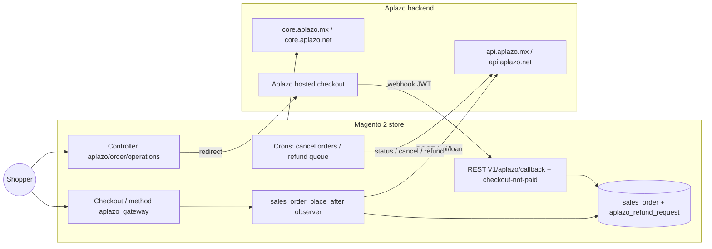

# Aplazo Payment Gateway for Magento 2

Magento 2 / Adobe Commerce payment module that adds **Aplazo** (Buy Now, Pay Later —
_"paga en 5 quincenas"_) as a checkout payment method.

- **Module name:** `Aplazo_AplazoPayment`
- **Composer package:** `aplazo/aplazopayment`
- **Payment method code:** `aplazo_gateway`
- **Current version:** `4.0.10`
- **Tracking platform code:** `MGT`
- **Runtime dependency:** [`firebase/php-jwt`](https://github.com/firebase/php-jwt) `^6.0`

## What it does

The merchant receives 100% of the order value up front; Aplazo finances the shopper
in installments. The module orchestrates the full lifecycle:

1. Renders the Aplazo method at checkout and on product/cart pages (widgets).
2. On order placement, creates a **loan** in Aplazo and redirects the shopper to the
   Aplazo hosted checkout.
3. Confirms the order asynchronously through a **JWT-signed webhook**.
4. **Cancels** unpaid orders (abandoned checkout + a safety-net cron).
5. Processes **refunds and RMA** through a resilient, idempotent queue.
6. Emits **analytics events** and **remote logs** to Aplazo for observability.

## Architecture at a glance

## Documentation map

| Page | What you'll find |
|------|------------------|
| [Getting Started](getting-started.md) | Install, enable, configure credentials |
| [Configuration](configuration.md) | Every admin field and its config path |
| [Checkout Flow](checkout-flow.md) | Order → loan → redirect → confirmation, step by step |
| [Webhook & Callbacks](webhooks.md) | The JWT-signed callback and abandoned-checkout endpoint |
| [API Reference](api-reference.md) | Aplazo endpoints consumed + REST endpoints exposed |
| [Refunds & RMA](refunds.md) | The refund queue, retries, idempotency, RMA |
| [Cron & CLI](cron-and-cli.md) | Scheduled jobs and console commands |
| [Data Model](data-model.md) | DB tables, order columns, custom statuses |
| [Observability](observability.md) | Logging (local + remote) and tracking events |
| [Troubleshooting](troubleshooting.md) | Common problems and how to diagnose them |

!!! note "Ownership"
    Squad **merchant-growth** today; ownership is expected to move to the new
    **bnpl-online** squad after the engineering restructure. Verify entity
    references in [`yaml.aplazo-platform-catalog`](https://github.com/aplazo/yaml.aplazo-platform-catalog).
