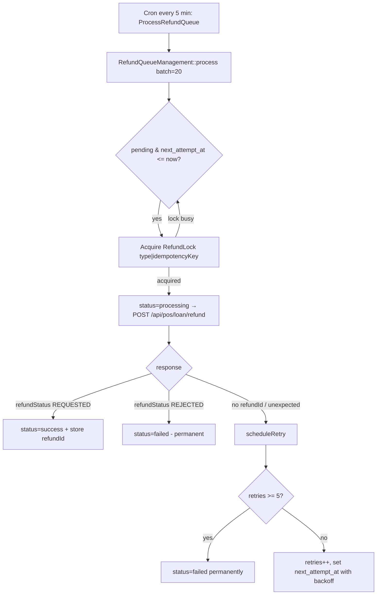

# Refunds & RMA

Refunds are **not** sent to Aplazo synchronously. They are enqueued and processed by a
cron with retries, idempotency, and locking — so a transient Aplazo/network failure
never loses a refund.

## How refunds are enqueued

| Trigger (event) | Observer | Queue `type` | Guard |
|---|---|---|---|
| Credit memo saved (`sales_order_creditmemo_save_after`) | `RefundObserverAfterSave` | `refund` | `refund` config enabled |
| RMA saved (`rma_save_after`, Adobe Commerce) | `RmaObserverAfterSave` | `rma` | `rma_refund` config enabled |

Each enqueues a row in `aplazo_refund_request` with the computed payload, an
**idempotency key**, amount in cents, and status `pending`.

## Processing



- **Batch size:** 20 per run.
- **Selection:** `status = pending` AND (`next_attempt_at IS NULL` OR `<= now`),
  oldest first.
- **Locking:** `RefundLock` keyed by `type|idempotencyKey` prevents parallel
  processing across multiple cron workers. Lock contention does **not** consume the
  retry budget.
- **Idempotency:** the `X-Idempotency-Key` header + a unique DB constraint on
  `(type, idempotency_key)` guarantee a refund is submitted at most once even across
  retries.

## Retry & backoff

Max **5** retries. Backoff schedule (minutes) by prior retry count:

| Retry # | 0→1 | 1→2 | 2→3 | 3→4 | 4→5 |
|---|---|---|---|---|---|
| Wait | 1m | 5m | 15m | 60m | 180m |

After the 5th failed attempt the request is marked `failed` and a note is added to the
order's status history.

## Response handling

| `refundStatus` | Outcome |
|---|---|
| `REQUESTED` | `success` — store `aplazo_refund_id`; for `rma` type, increment `qty_aplazo_refunded` on the RMA item |
| `REJECTED` | `failed` — permanent; order history annotated |
| missing `refundId` | retry (backoff 1m) |
| any other value | retry (backoff 5m) |

Every terminal outcome appends a comment to the order status history
(e.g. _"Aplazo refund processed successfully. RefundId: …"_).

## Admin visibility

An **Aplazo refund queue** grid is available under Sales (ACL resource
`Aplazo_AplazoPayment::aplazo_refund_queue`, nested under
`Magento_Sales::creditmemo`), letting operators inspect queued/failed refunds.

## Manual processing

```bash
php bin/magento aplazo:refund:process   # process the queue now (same as the 5-min cron)
```

See [Cron & CLI](cron-and-cli.md).
