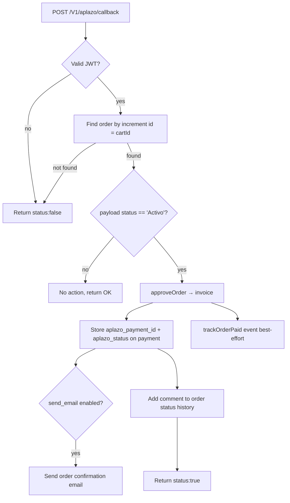

# Webhook & Callbacks

The module exposes two REST endpoints (declared in `etc/webapi.xml`). Both are served
under the Magento Web API base, e.g. `https://<store>/rest/default/V1/...`.

## Payment confirmation webhook

```
POST /V1/aplazo/callback/
Resource: anonymous
Service:  Aplazo\AplazoPayment\Api\NotificationsInterface::notify
```

Called by Aplazo when a loan changes state. Request body maps to the interface
parameters:

| Param | Meaning |
|-------|---------|
| `loanId` | Aplazo loan identifier |
| `status` | Loan status. `"Activo"` triggers order approval |
| `cartId` | The Magento order **increment id** (used to locate the order) |

### Security — JWT (HS512)

Although the route is `anonymous`, every call is authenticated by a **JWT** in the
`Authorization: Bearer <jwt>` header:

```php
JWT::decode($jwt, new Key($apiToken, 'HS512'));
```

- The signing key is the merchant's **API token** (the same secret configured in
  admin, `payment/aplazo_gateway/apitoken`).
- The **decoded JWT payload** — not the raw POST body — is the trusted source of
  `loanId`, `status`, and `cartId`. Payload keys: `loanId`, `status`, `cartId`.
- If decoding fails, the webhook returns `{ status: false, message: ... }` and takes
  no action.

### Processing logic



Notes:

- The webhook **advances the order to processing regardless of invoice creation**
  problems (invoice failures are logged, not fatal).
- Order confirmation email is sent **only** when `send_email` is enabled; otherwise
  the default Magento new-order email is suppressed to avoid duplicates.
- A status-history comment is added ("Notificación automática de Aplazo…").

### Callback URL

The callback URL the merchant registers with Aplazo is built by the module as:

```
{store base url}rest/default/V1/aplazo/callback
```

(`Helper\Data::getCallbackUrl()`).

## Abandoned checkout

```
POST /V1/aplazo/checkout-not-paid
Resource: Magento_Sales::cancel
Service:  Aplazo\AplazoPayment\Api\CheckoutNotPaidManagementInterface::postCheckoutNotPaid
```

Invoked (via the frontend `Operations::cancel` action, guarded by the cancel token)
when a shopper returns from the Aplazo checkout without paying. It:

1. Cancels the order and clears the checkout session.
2. If **recover cart** is enabled, rebuilds a new quote from the order's visible
   items (preserving customer context and `info_buyRequest` options) and replaces the
   session quote so the shopper can retry.
3. Returns a message (`cancel_message`) and, on success, the new `quoteId`.

!!! info "Why a cancel token?"
    The redirect URL stored on the order is `"<aplazo url>||<random token>"`. The
    `purchase` action uses the left side (the URL); the `cancel` action requires the
    right side (the token) to match, preventing arbitrary third-party cancellation of
    an order by increment id alone.
